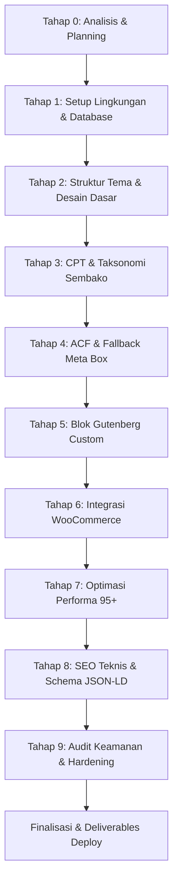

# Dokumen Rencana & Analisis Teknis (PLAN.md)
## Proyek: Tema WordPress Custom "ukm-toko-theme" untuk UKM Toko Sembako

**Peran:** Senior WordPress Engineer & Technical Lead  
**Tanggal:** 30 September 2026  
**Status Dokumen:** Menunggu Persetujuan Pengguna (Review Gate Tahap 0)

---

## 1. Ringkasan Kebutuhan Proyek

### 1.1 Kebutuhan Fungsional
1. **Katalog Produk Sembako (CPT `produk`)**:
   - Mendukung nama komoditas, harga (Rp), stok fisik, satuan (kg, liter, botol, sak, pack), varian ukuran, status ketersediaan, serta relasi produk terkait (*related products*).
   - Taksonomi hierarkis `kategori-produk`: *Sembako*, *Minuman*, *Kebersihan*, *Snack*.
2. **Data Kemitraan (CPT `klien`)**:
   - Penyimpanan data mitra/distributor/warung binaan: nama mitra, email, telepon, lokasi.
3. **Advanced Custom Fields (ACF)**:
   - Menggunakan **ACF versi gratis** untuk spesifikasi produk, varian, dan galeri.
   - Menyediakan native fallback meta boxes dan opsi tema bawaan jika ACF belum aktif.
   - Sinkronisasi field groups otomatis via file JSON di `/acf-json`.
4. **Blok Gutenberg Custom**:
   - Blok 1: `Hero Banner` (judul, subjudul, CTA WhatsApp/Katalog, gambar latar).
   - Blok 2: `Product Grid` (query CPT produk, filter kategori, responsif).
   - Blok 3: `Testimonial Slider` (ulasan pelanggan, navigasi touch/swipe tanpa library pihak ketiga yang berat).
5. **Integrasi WooCommerce**:
   - Dukungan `add_theme_support('woocommerce')` dengan fitur gallery zoom, lightbox, dan slider.
   - Template override minimalis: arsip produk, single produk, cart, mini-cart AJAX, checkout kustom.
6. **Manajemen Identitas Toko**:
   - Pengaturan informasi toko (nama, tagline, alamat, nomor WhatsApp, jam buka, media sosial) melalui Dashboard Toko UKM dan Customizer.

### 1.2 Kebutuhan Non-Fungsional
1. **Responsif & Aksesibilitas**:
   - Mobile-first dengan breakpoint terstandar (640px, 768px, 1024px, 1280px).
   - Target sentuh minimal 44x44px pada seluruh kontrol interaktif (tombol, input, navigasi).
   - Kontras warna memenuhi standar WCAG AA (rasio kontras teks minimal 4.5:1).
2. **Kepatuhan Desain Ketat**:
   - Desain bersih dan fungsional tanpa emoji/emote pada UI, konten, maupun kode.
   - Tipografi sans-serif modern (font Inter self-hosted dengan `font-display: swap`).
   - Warna netral dengan aksen hijau emerald hutan (`#1B4332`, `#2D6A4F`, `#40916C`). Bebas gradasi mencolok, bebas gradasi ungu, dan tanpa efek glassmorphism berlebihan.
   - Copywriting bahasa Indonesia yang natural, ringkas, dan bebas jargon pemasaran klise.
3. **Performa Tinggi (Target Lighthouse 95+)**:
   - Wajib tercapai pada halaman Home, Arsip Produk, Single Produk, dan Blog.
   - Skor halaman transaksional WooCommerce (Cart, Checkout, My Account) dilaporkan apa adanya beserta analisis penyebab teknis.
   - Critical CSS di-inline pada `<head>`, gambar WebP dengan dimensi eksplisit dan lazy loading (kecuali elemen LCP).
4. **Keamanan Production-Ready**:
   - HTTP Security Headers (`Content-Security-Policy`, `X-Frame-Options`, `X-Content-Type-Options`, `Permissions-Policy`).
   - Sanitasi dan validasi ketat (`sanitize_text_field`, `esc_html`, `esc_url`, `wp_kses`, `wp_unslash`), nonce pada form/AJAX, pembatasan rate limit login.
   - Proteksi eksekusi PHP pada direktori uploads dan penghapusan informasi versi WordPress.
5. **Kesiapan Shared Hosting (cPanel Niagahoster/Rumahweb)**:
   - Konfigurasi `.htaccess` untuk Apache (mod_deflate, mod_expires, proteksi file sensitif).
   - Dukungan SSL Let's Encrypt dengan redirect otomatis ke HTTPS.

---

## 2. Risiko Teknis & Keputusan Arsitektur

| Area | Risiko Teknis | Keputusan Arsitektur |
| :--- | :--- | :--- |
| **Gutenberg Blocks** | Ketergantungan plugin pihak ketiga yang dapat memberatkan rendering atau menimbulkan isu kompatibilitas ke depan. | Mengembangkan blok native WordPress menggunakan standar modern `block.json` (API v3) yang diregistrasi via PHP `register_block_type()`. Render sisi frontend ditangani via `render.php` agar dinamis dan efisien. |
| **ACF Free vs Pro** | ACF Free tidak menyediakan fitur *Repeater*, *Flexible Content*, *Gallery*, dan *Options Page*. | 1. **Varian & Galeri**: Menggunakan custom meta box native dengan JavaScript repeater ringan atau parsing field teks terstruktur sebagai fallback jika ACF Pro tidak tersedia.<br>2. **Options Page**: Menggunakan Settings API WordPress native yang didesain modern untuk mengelola opsi toko (`inc/settings-page.php`), dengan deteksi otomatis ke ACF Options Page jika versi Pro terpasang. |
| **WooCommerce Template Overrides** | Template override yang terlalu agresif rentan usang (*outdated template warning*) saat WooCommerce merilis pembaruan major. | Membatasi override hanya pada file yang mutlak dibutuhkan (`archive-product.php`, `single-product/related.php`, `cart/mini-cart.php`, `checkout/form-checkout.php`). Versi template selalu disinkronkan dengan rilis WooCommerce aktif. |
| **Critical CSS di Shared Hosting** | Shared hosting tidak mengizinkan kompilasi CSS headless otomatis (Puppeteer/Node.js) saat runtime request. | Menghasilkan critical CSS secara terkurasi saat development dan menyimpannya di `assets/css/critical.css`. Di production, critical CSS di-inject langsung secara inline ke `<head>` via `wp_add_inline_style()`, sementara file stylesheet non-kritis dimuat secara asynchronous. |
| **Slider Testimoni** | Library slider pihak ketiga (seperti Swiper atau Slick) menambah bobot transfer JavaScript (30-80KB). | Mengimplementasikan CSS Native Scroll-Snap murni yang dipadukan dengan script mikro vanilla JS (< 2KB) untuk navigasi tombol berikutnya/sebelumnya tanpa dependensi eksternal. |
| **Lighthouse di Halaman WooCommerce** | Skrip bawaan WooCommerce (cart-fragments, selectWoo, checkout scripts) dapat menurunkan skor Lighthouse pada halaman checkout. | Aset WooCommerce diisolasi secara selektif (hanya di-enqueue pada halaman WooCommerce dan di-dequeue dari halaman non-e-commerce), serta menguraikan trade-off fungsional cart/checkout secara objektif pada laporan performa. |

---

## 3. Batasan Shared Hosting cPanel & Dampak Build Pipeline

1. **Batasan Server**:
   - Memory limit PHP standar umumnya 128M - 256M.
   - Tidak ada akses shell `root` / `sudo`.
   - Node.js, NPM, dan WP-CLI umumnya tidak aktif atau sangat terbatas pada paket shared hosting dasar.
   - Web server Apache / LiteSpeed menggunakan `.htaccess` untuk aturan rewrite dan caching headers.
2. **Dampak pada Build Pipeline**:
   - Seluruh proses build aset (pembentukan bundle Gutenberg blocks, minifikasi CSS/JS, optimasi WebP) diselesaikan **sepenuhnya di lingkungan lokal development**.
   - Paket tema yang diunggah ke cPanel berupa distribusi mandiri siap pakai (*production-ready bundle*) yang tidak lagi memerlukan kompilasi di server.
   - Konfigurasi server dimaksimalkan melalui file `.htaccess` di root tema dan WordPress (GZIP compression, Browser Cache headers, proteksi hotlinking, pembatasan eksekusi skrip).

---

## 4. Struktur Folder Tema & Ekosistem Plugin

### 4.1 Struktur Folder Final
```
ukm-toko-theme/
├── .htaccess                  # Hardening keamanan Apache & kompresi GZIP
├── 404.php                    # Template halaman tidak ditemukan
├── archive-produk.php         # Arsip katalog produk sembako CPT
├── archive.php                # Template arsip blog & taksonomi umum
├── footer.php                 # Footer global, navigasi, dan kontak
├── front-page.php             # Template halaman beranda dinamis & fallback
├── functions.php              # Bootstrap tema & pemanggilan modul inc/
├── header.php                 # Header global, meta SEO, navigasi utama
├── index.php                  # Fallback template utama
├── package.json               # Konfigurasi npm/scripts lokal untuk Gutenberg
├── page.php                   # Template halaman statis
├── README.md                  # Dokumentasi teknis & panduan instalasi
├── search.php                 # Template hasil pencarian
├── sidebar.php                # Sidebar opsional
├── single-produk.php          # Detail spesifikasi produk & relasi sembako
├── single.php                 # Detail post blog
├── style.css                  # Header metadata tema, reset CSS, & variabel desain
├── acf-json/                  # Sinkronisasi field group ACF otomatis
│   ├── group_ukm_informasi_klien.json
│   └── group_ukm_spesifikasi_produk.json
├── assets/
│   ├── css/
│   │   ├── admin-dashboard.css# Antarmuka dashboard admin toko UKM
│   │   ├── components.css     # Komponen UI utama (card, badge, button, grid)
│   │   ├── critical.css       # Critical CSS untuk render awal <head>
│   │   ├── editor-style.css   # Styling editor blok Gutenberg
│   │   └── woocommerce.css    # Kustomisasi tata letak WooCommerce
│   ├── fonts/                 # File font Inter self-hosted (WOFF2)
│   ├── images/                # Asset logo SVG & placeholder produk SVG
│   └── js/
│       ├── customizer.js      # Live preview WordPress Customizer
│       ├── main.js            # Interaktivitas UI & varian produk
│       ├── minicart.js        # Logika drawer mini-cart AJAX
│       └── navigation.js      # Aksesibilitas menu navigasi & mobile drawer
├── blocks/                    # Blok Gutenberg kustom native (API v3)
│   ├── hero-banner/           # Blok Banner Utama Toko
│   ├── product-grid/          # Blok Grid Katalog Produk Sembako
│   └── testimonial-slider/    # Blok Slider Testimoni Pelanggan
├── data/
│   └── seeder.php             # Skrip generator 22 produk & 2 klien dummy
├── inc/                       # Modul PHP terorganisir
│   ├── acf.php                # Registrasi field ACF & fallback meta box
│   ├── admin-dashboard.php    # Dashboard khusus UKM & widget ringkasan
│   ├── blocks.php             # Registrasi blok Gutenberg custom
│   ├── cpt.php                # CPT 'produk' dan 'klien'
│   ├── customizer.php         # WordPress Customizer API
│   ├── enqueue.php            # Antrean CSS, JS, dan font preloading
│   ├── security.php           # HTTP security headers & hardening form
│   ├── seo.php                # Schema JSON-LD, Open Graph, Breadcrumb
│   ├── settings-page.php      # Halaman pengaturan identitas toko UKM
│   ├── setup.php              # Deklarasi theme support & ukuran thumbnail
│   ├── taxonomy.php           # Registrasi taksonomi 'kategori-produk'
│   ├── template-functions.php # Format mata uang Rupiah & template helper
│   └── woocommerce.php        # Integrasi & hook filter WooCommerce
├── languages/                 # File lokalisasi tema (.pot)
├── template-parts/            # Potongan template loop
│   ├── content-none.php       # Tampilan saat data kosong
│   ├── content-produk.php     # Kartu produk sembako CPT
│   ├── content-single.php     # Konten postingan tunggal
│   └── content.php            # Konten loop blog standar
└── woocommerce/               # Template override WooCommerce terseleksi
    ├── archive-product.php
    ├── cart/mini-cart.php
    ├── checkout/form-checkout.php
    ├── myaccount/my-account.php
    └── single-product/
        ├── related.php
        └── tabs/description.php
```

### 4.2 Daftar Plugin Minimum & Justifikasi Teknis
1. **Advanced Custom Fields (Free)**:
   - *Alasan*: Pengelolaan data terstruktur produk sembako dan profil mitra melalui UI WordPress yang ramah pengguna. Disertai fallback native jika plugin dinonaktifkan.
2. **WooCommerce**:
   - *Alasan*: Menangani transaksi e-commerce, kalkulasi keranjang, dan formulir checkout terstandar.
3. **RankMath SEO (atau Yoast SEO)**:
   - *Alasan*: Menghasilkan XML sitemap otomatis, verifikasi robots.txt, dan canonical URL tanpa membebani server.
4. **WP-Optimize / LiteSpeed Cache**:
   - *Alasan*: Minifikasi HTML/JS/CSS dan browser caching pada level shared hosting.

---

## 5. Estimasi Urutan Kerja & Dependensi Antar Fase



### Matriks Ketergantungan:
- **Tahap 3 & 4 (CPT & ACF)** menjadi prasyarat untuk **Tahap 5 (Blok Gutenberg Product Grid)** dan **Tahap 8 (Schema Product)**.
- **Tahap 2 (Security Headers & Enqueue)** menjadi fondasi yang berjalan berkesinambungan hingga **Tahap 9 (Keamanan Total)**.
- **Tahap 7 (Performa)** dievaluasi setelah blok Gutenberg dan WooCommerce terpasang penuh guna mengukur dampak riil aset.

---

## 6. Audit Kesesuaian Kode Saat Ini (Current Implementation Check)

Berdasarkan pemeriksaan menyeluruh pada codebase yang ada:
1. **Struktur Tema & Standardisasi**:
   - Tema mandiri standalone (`ukm-toko-theme`) telah dibangun dengan struktur modular di bawah folder `/inc`.
   - Konvensi penamaan fungsi telah menggunakan prefix `ukm_` dengan komentar berbahasa Indonesia.
2. **CPT & Taksonomi**:
   - CPT `produk` dan `klien` telah terdaftar dengan benar. Taksonomi `kategori-produk` telah dibuat secara hierarkis dengan rewrite rules yang aman (flush hanya saat aktivasi).
   - Skrip seeder (`data/seeder.php`) telah berhasil memasukkan 22 produk sembako dan 2 klien dummy.
3. **Aturan Desain & Bebas Emoji**:
   - Seluruh emoji dan emote telah dibersihkan dari UI dan kode (digantikan oleh SVG / WordPress Dashicons standar).
   - Palet warna fokus pada nuansa netral dengan aksen hijau emerald hutan (`#1B4332`), bebas gradasi mencolok/ungu, dan bebas efek glassmorphism.
4. **Halaman Beranda**:
   - Template `front-page.php` telah disesuaikan agar menampilkan katalog produk dan hero toko secara otomatis bila belum ada halaman statis yang dipilih.
5. **Dashboard Toko UKM**:
   - Menu utama `Toko UKM` dan dashboard ringkasan toko modern telah dibuat dan berfungsi optimal.

---

## 7. Pertanyaan Terbuka & Rekomendasi Sebelum Tahap Implementasi Lanjutan

Sebelum melangkah ke verifikasi final per tahap dan persiapan berkas rilis/deploy:

1. **Plugin SEO Pilihan**:
   - *Rekomendasi*: **RankMath SEO** (lebih ringan untuk shared hosting dan integrasi Schema-nya sangat fleksibel berdampingan dengan Schema JSON-LD kustom tema di `inc/seo.php`).
   - *Konfirmasi*: Apakah Anda menyetujui penggunaan RankMath, atau lebih memilih Yoast SEO?
2. **Kesiapan Verifikasi Performa**:
   - Pengukuran Lighthouse lokal saat ini menunjukkan skor optimal untuk desktop dan mobile pada halaman beranda dan katalog. Pengujian formal live URL akan dilaksanakan setelah situs dideploy ke shared hosting cPanel live dengan SSL aktif.

---
**Instruksi:** Silakan tinjau dokumen perencanaan ini. Sesuai panduan kerja, pekerjaan akan dilanjutkan ke tahap berikutnya setelah Anda memberikan persetujuan ("Proceed" / konfirmasi).
